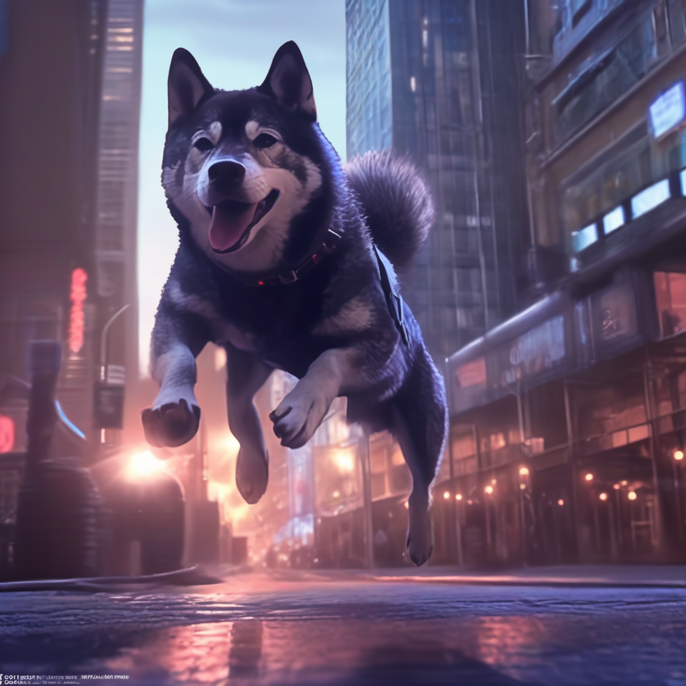
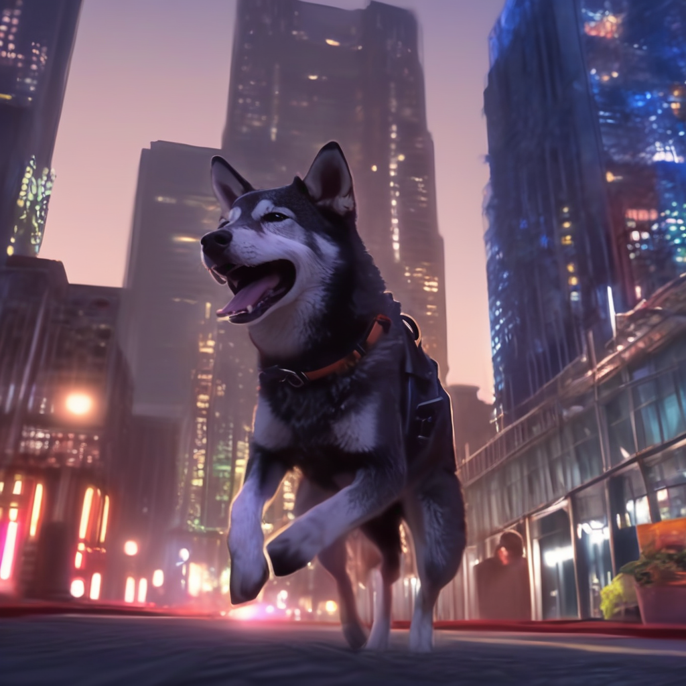
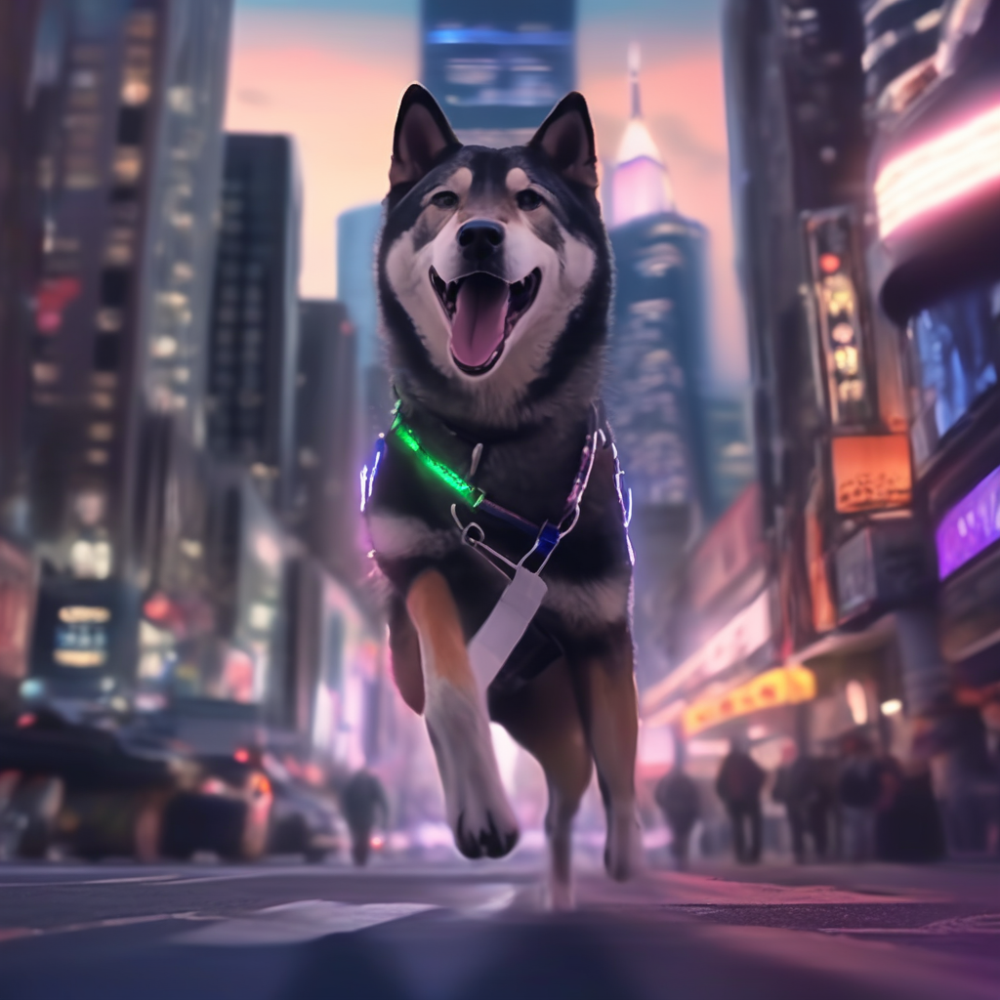

# lora-sdxl-kuroshiba-raizo
## 概要
LoRA DreamBooth - mussso/lora-sdxl-kuroshiba-raizo
stabilityai/stable-diffusion-xl-base-1.0用のLoRA適応重みです。
重みはDreamBoothを使って黒柴らいぞうの写真で学習されました。以下に画像の例を示します。

学習に使用した特殊なVAE：madebyollin/sdxl-vae-fp16-fix。

以下のURLからモデルを試してみてください。

## Overview
LoRA DreamBooth - mussso/lora-sdxl-kuroshiba-raizo
These are LoRA adaption weights for stabilityai/stable-diffusion-xl-base-1.0. The weights were trained on a photo of Kuroshiba raizo using DreamBooth. You can find some example images in the following.

Special VAE used for training: madebyollin/sdxl-vae-fp16-fix.

Try the model at the URL below.
https://huggingface.co/mussso/lora-sdxl-kuroshiba-raizo

